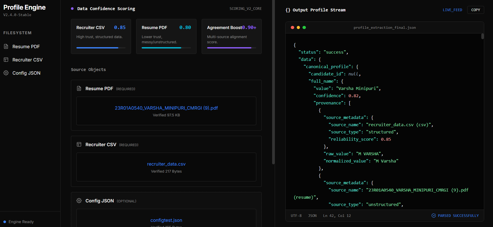
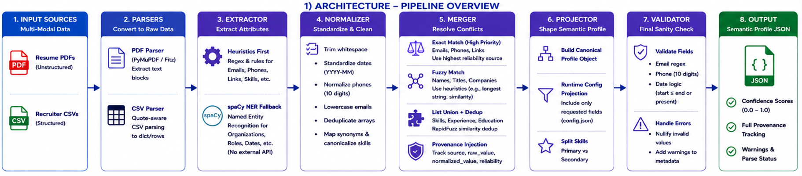
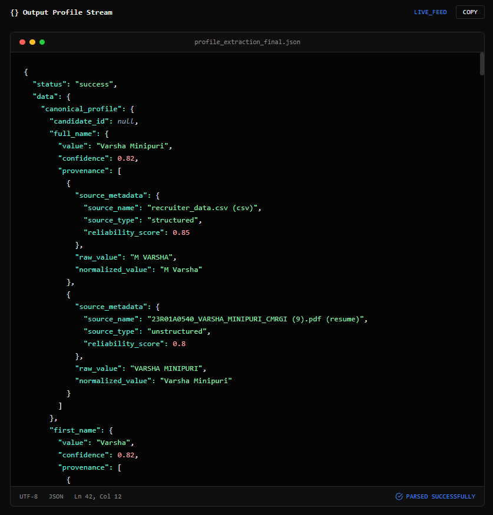

<div align="center">
  
# 🎯 Candidate Profile Engine

An advanced, LLM-assisted semantic data extraction and merging pipeline built with **FastAPI**, **Python**, and a **Vanilla JS** frontend. 

This engine is designed to ingest fragmented and noisy candidate data from multiple distinct sources (e.g., highly unstructured Resume PDFs and structured Recruiter CSV files), parse them, validate them using advanced NLP (spaCy), and merge them into a single, highly reliable canonical JSON profile.


</div>

---
## 🎥 Video Demonstration
Click below to watch a quick walkthrough of the Candidate Profile Engine in action:

https://github.com/user-attachments/assets/8b0e5861-5409-419d-8189-1b5bde401c3c

## 🎥 Video Demonstration

Click below to watch a quick walkthrough of the Candidate Profile Engine in action:

**[▶️ Watch the Demo Video Here](#)** 

---

## 🚀 Key Features

* **Multi-Modal Parsing:** Natively handles unstructured `PDF` files (using `PyMuPDF`) and structured `CSV` files, translating both into a normalized internal schema.
* **NLP Fallback:** Uses deterministic heuristics for speed, but seamlessly falls back to a powerful local NLP engine (`spaCy`) to untangle complex layouts by performing Named Entity Recognition (NER) on organizations, dates, and roles.
* **Semantic Merging Engine:** Resolves conflicts between data sources using `RapidFuzz` for fuzzy string matching, list unioning, and priority-based exact match overrides.
* **Data Provenance Tracking:** Every single field in the final output JSON maintains a detailed `provenance` log tracing the data back to the exact files (e.g., `resume.pdf`) that contributed to it.
* **Confidence Scoring:** Dynamically calculates a confidence score `[0.0 - 1.0]` for every data point based on source reliability and multi-source agreement boosts.
* **Zero-Dependency UI:** A beautiful, dark-themed frontend featuring drag-and-drop file zones, custom modal overlays, and a syntax-highlighted JSON terminal.

---

## 🧠 System Architecture

The pipeline processes data through a 6-stage DAG architecture:




1. **Parsers:** Converts raw files into flat text or structural dictionaries (`fitz` for PDFs, `csv` for data).
2. **Extractor:** Slices raw text into candidate attributes using Regex heuristics and NLP validation.
3. **Normalizer:** Cleans extracted data (e.g., standardizing date formats to `YYYY-MM`).
4. **Merger:** The heart of conflict resolution. Prioritizes trusted sources, deduplicates arrays, and maps provenance.
5. **Projector:** Dynamically shapes the output based on runtime configuration (`config.json`).
6. **Validator:** The final sanity check (email regexes, phone digit lengths) that gracefully appends warnings without crashing.

---

## ⚙️ Quick Start Guide

Follow these steps to run the engine locally on your machine.

### 1. Prerequisites
Ensure you have the following installed:
- Python 3.10 or higher
- Git

### 2. Clone the Repository
```bash
git clone <your-repo-url>
cd candidate-profile-engine
```

### 3. Set Up a Virtual Environment
It's best practice to run Python projects in an isolated environment.
```bash
# For Windows
python -m venv venv
venv\Scripts\activate

# For Mac/Linux
python3 -m venv venv
source venv/bin/activate
```

### 4. Install Dependencies
```bash
pip install -r requirements.txt
python -m spacy download en_core_web_sm
```

### 6. Run the Server
Launch the FastAPI backend engine:
```bash
uvicorn app.main:app --reload
```

### 7. Access the Dashboard
Open your web browser and navigate to:
**[http://localhost:8000](http://localhost:8000)**




## 📂 Project Structure

```text
candidate-profile-engine/
│
├── app/
│   ├── main.py                  # FastAPI Application Entrypoint
│   │
│   ├── core/                    # Engine Business Logic
│   │   ├── extractor.py         # Regex + NLP slicing logic
│   │   ├── ai_validator.py      # spaCy NER engine for edge cases
│   │   ├── normalizer.py        # Data cleaning and formatting
│   │   ├── merger.py            # Conflict resolution & fuzzy matching
│   │   ├── projector.py         # Config-driven output shaping
│   │   └── validator.py         # Final sanity checks & warnings
│   │
│   ├── models/                  # Pydantic Schemas (Strict Typing)
│   │   ├── candidate.py         # Core Canonical Profile schema
│   │   ├── source.py            # Provenance and Metadata wrappers
│   │   └── config.py            # Runtime configuration schema
│   │
│   ├── parsers/                 # Ingestion Layer
│   │   ├── base_parser.py       # Abstract base class
│   │   ├── csv_parser.py        # Quote-aware CSV reader
│   │   └── pdf_parser.py        # PyMuPDF (fitz) text extractor
│   │
│   ├── static/                  # Vanilla UI
│   │   ├── index.html           # Dark-themed HTML dashboard
│   │   ├── styles.css           # Custom scrollbars & CSS tokens
│   │   └── script.js            # Async upload & modal logic
│   │
│   └── utils/                   # Helpers
│       ├── config_loader.py     # Loads requested output fields
│       ├── constants.py         # Source reliability weights
│       └── helpers.py           # RapidFuzz wrappers
│
├── sample_data/                 # Test Resumes and CSVs
├── tests/                       # Unit tests & Gold Profiles
└── requirements.txt             # Python dependencies
```

---

## 🧪 Running Tests

The engine includes a suite of `pytest` unit tests that verify the extraction, normalization, and merging logic against "gold standard" profile schemas.

### Key Test Suites Included:
* **`test_parsers.py`** — Verifies that `PyMuPDF` and the `csv` parser correctly read raw data without truncation.
* **`test_extractor.py`** — Validates the Regex and `spaCy` NLP Named Entity Recognition for extracting names, emails, and skills.
* **`test_normalizer.py`** — Ensures date standardizations (e.g., converting "Oct 24" to "2024-10") and whitespace trimming work flawlessly.
* **`test_merger.py`** — Tests the `RapidFuzz` logic to ensure conflicting data across CSV and PDF is gracefully merged and deduplicated.
* **`test_validator.py`** — Checks that the constraint engine successfully catches malformed emails/phones and assigns proper `[0.0 - 1.0]` confidence scores.
* **`test_edge_cases.py`** — Runs extreme scenarios like totally empty resumes, missing fields, and corrupted CSVs to guarantee the engine never crashes.
* **`test_pipeline.py`** — Tests the full End-to-End (E2E) Directed Acyclic Graph (DAG) execution.

To run the test suite:
```bash
pytest
```
*(Or use `pytest -v` for verbose output).*

---

